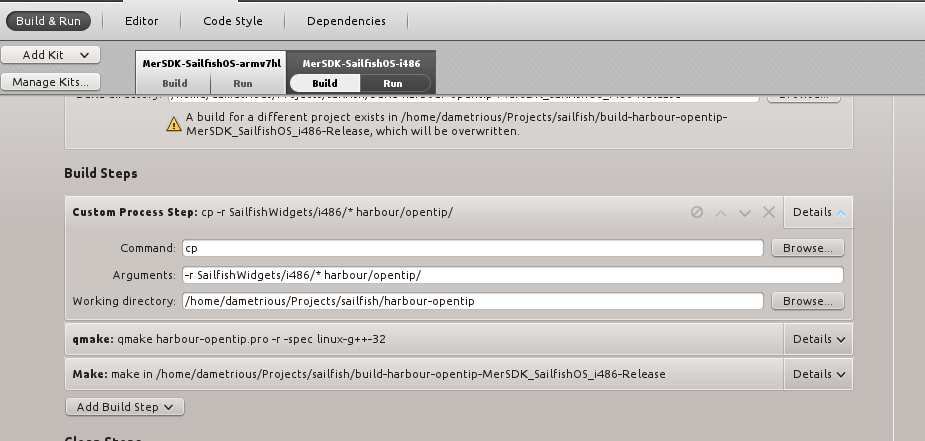

<h2>About</h2>
Sailfish.Silica 1.0 compatible widgets which aim to speed up development by implementing Jolla recommended platform styles.

<h2>License</h2>

This project is GPLv3 unless otherwise indicated on the file itself. Files with other licenses are copyrighted to their respective owners.

Version 1.1.2

<h2>Jolla Store Instructions: </h2>
If you are in doubt that this will pass inspection <strong>use the tag feature and get a stable release<strong>. Tagged releases will <strong>always</strong> be tested by including it into a third party app that is on the app store. Of course, this means you will miss out on beta features and patches until then.

The following are instructions to using SailfishWidgets with your own project. This project will <strong>PASS</strong> Jolla QA as long as you follow the following instructions. If you find a more clever way to do this, by all means share :-). Replace <em>your-project</em> with the name of your application (without the harbour-)
<ol>
  <li> First, download the source code and put the <code>SailfishWidgets</code> folder within the <code>harbour/<em>your-project</em></code> directory</li>
  <li> Then, edit the first line of qmldir. This is easiest accomplished with the following BASH command. 
<pre>find . -name "qmldir" -exec sed -i "s/module SailfishWidgets/module harbour.<em>yourAppName</em>.SailfishWidgets/" \{} \;</pre>.
If you are on Windows, manually edit each qmldir that you use to <code>module harbour.<em>your-project</em>.SailfishWidgets.</em>CurrentPackage</em></code>.</li>
  <li> For using with QtCreator add the following
<pre>
OTHERFILES += harbour/<em>your-app</em>/SailfishWidgets/*
QML_IMPORT_PATH = .
<em>your-app</em>.files = harbour
<em>your-app</em>.path = /usr/share/$${TARGET}
</pre>
   </li>
   <li> In any QML file you want to edit add the following import statement: <code>import harbour.<em>your-app</em>.SailfishWidgets.<em>SomePackage</em> <em>current-version</em></code></li>
</ol>

<h2> Using native plugins </h2>
Sailfish Widgets provides native plugins that target both the Sailfish VM and arm device (cell phone). One such plugin is the ApplicationSettings which links QML user defined properties to a line entry in a QSettings configuration file. The following instructions will help you easily configure your project so that you can take advantage of these plugins for testing and project deployment.

If you do not need these custom plugins then by all means you may skip the following.

<h3>Switching between VM and Device plugins</h3>
If you additionally want to use QML plugins, like ApplicationSettings, then it is best to configure your project settings to switch the SailfishWidgets source library from i486 (VM) to the device (armv) and vice versa.

You can do this by adding a custom build step which will copy the appropriate Sailfish release directory into a common folder <em>harbour/your-app</em> so that you can test easily. It is ok to do a straight <em>cp -r</em> because the qml sources are the same, only the library (.so) file will be overwritten; so none of your QML import paths need to change.

<strong>Remember:</strong> If you decide to go this route, remember to rename the qmldir module path by running the command in step 2 above. (Optionally, you can automate this process as well using a custom build setting.)</strong>

<h3>Update your spec file</h3>
The RPM tool will put the native library into the provides section and this is strictly disallowed according to the Harbour Store policies.

See <a href="https://harbour.jolla.com/faq#2.6.0">Provides: libFooBar.so.1' not allowed in RPM</a>

The suggested solutions is to put the following line in between the <code># &gt;&gt; macros</code> and <code># &lt;&lt; macros</code> section in the <em>your-app</em>.spec file.
<pre>%define __provides_exclude_from ^%{_datadir}/.*$</pre>

<h2>Contribute</h2>

This application is open source,  but please do contribute to active development!

You can contribute in one of two ways:
<ul>
<li>Fork this branch and make pull request! (Please create an issue ticket first, though)
<li>Donate Bitcoins
</ul>

<code>1PFqgHeGrtXLYvMge2mTT1FohKuuoKmUN5</code>

THANK YOU!

<h2>Links</h2>
<a href="http://qt-project.org/doc/qt-5/qtqml-modules-qmldir.html">qmldir specification</a>

 
Copyright ©2014 Dametrious Peyton. All Rights Reserved
